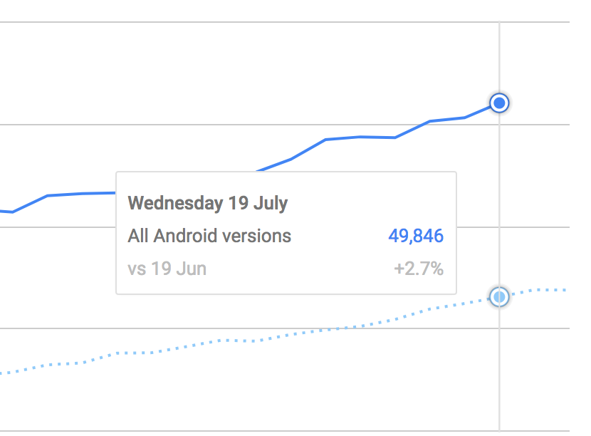
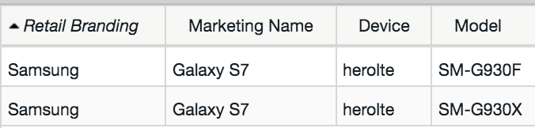
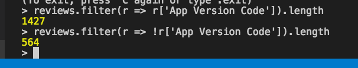

# Purpose
We are attempting to get the following information for Kiwix Mobile (Android app):
- Device Model
- Android Version
- App Version
- Locale

There are a few different sources we have thought to acquire this:
- Play Store Install Stats
- Play Store Review Information
- In-app analytics
- Asking People (survey)

Using the data, we would like to know how many of the potential combinations are available for testing with TestDroid / Google Device Lab / Amazon Device Lab.

The information is being obtained from Google Cloud storage (UTF-16 CSV):
[https://console.cloud.google.com/storage/browser/pubsite_prod_rev_14876298819229479527/](https://console.cloud.google.com/storage/browser/pubsite_prod_rev_14876298819229479527/)

> Access to this page requires permissions from Kiwix

## Play Store Install Stats

Install Stats come in 7 different aggregations:
- App Version
- Carrier
- Country
- Device
- Language
- OS Version
- Tablets

Unfortunately there is no way to corrolate between these aggregations - dead end.

## Play Store Review Information

The review CSVs have the following columns:
- Package Name
- App Version Code
- App Version Name
- Reviewer Language
- Device
- Star Rating
- Review Submit Date and Time
- Review Submit Millis Since Epoch
- Review Last Update Date and Time
- Review Last Update Millis Since Epoch
- Review Title
- Review Text
- Developer Reply Date and Time
- Developer Reply Millis Since Epoch
- Developer Reply Text
- Review Link

> Of the above columns, only the first 5 are particularly interesting to us.

A concatenated reviews (2017/01-2017/06) CSV is within this repo ([kiwix_reviews.csv](./kiwix_reviews.csv))

The Device column contains Google Device Codes. In order to map these to real world devices, we need to use the mappings found here:
[https://support.google.com/googleplay/answer/1727131?hl=en](https://support.google.com/googleplay/answer/1727131?hl=en)
A copy of the CSV from 2017/07/21 is available in this repo ([android_devices.csv](./android_devices.csv)).
There are currently 1991 reviews from 983 distinct devices (a tiny subset of the 49,846 users).


Next we need to generate all of the possible combinations of:
- App Version
- User Locale
- Device
- Android Version

There are a few difficulties here though...

### Getting Combinations

There is a NodeJS script at [generateCombinations.js](./generateCombinations.js) which outputs simple JSON to [combinations.json](./combinations.json).
If your environment is set up as defined in [ENVIRONMENT.md](./ENVIRONMENT.md) you will be able to generate a new copy by running:
```bash
> npm run combinations
```

#### Devices
This operation is complicated by the fact that the Google Device Codes are **NOT** one to one.
E.g.

Some Device codes (such as HS8937QC or g3) can correspond to over 18 different devices, only some of which (usually only one) will have actually been used to review the app. This leaves a lot of uncertainty.

#### Locale / Language
Things get even more difficult, however, when we come to look at languages.

We can't assume that all devices come in all languages, especially some of the budget phones that a lot of the Kiwix users tend to use. Furthermore, each one of the up to 20 devices for one Device Code, could only have been released in a certain region, with certain laguages.

This makes understanding user's devices and languages really difficult using just the Review data.

This is before we even move from Language to locale.

[Microsoft's Language Code Identifier (LCID) spec](https://msdn.microsoft.com/en-us/library/cc233982.aspx) shows many locales for a single language, take Spanish, with 27 individual locales.

When reviews are submited from a computer, it may be using a different locale, or even language to their device.

#### Android Version
Android Versions are yet another source of pain for when it comes to testing.
The review data provied by Google doesn't include Android Versions. Our only way of getting close is to *optimistically* assume the Android Version of the device when it was originally released.

There are multiple problems with this assumption:
- Not all of the Models of a Device Code will have shipped with the same version, or even at the same time
- Some devices may have been updated or had custom OS's installed since purchase
- Some devices have modified versions of Android installed by default (E.g. Samsung)

#### App Version

As if things weren't already hard enough - when reviews are submited from a computer, App Version Codes aren't recorded:



Here, we can see about a quater of Kiwix reviews in the last 6 months have no App Version assosciated with them.

### Conclusion
From all of this, we can find numerous problems with using review data for understanding users, their habits, languages, and usage. There just isn't enough data available.

## Asking people (Surveys)


## In-app analytics


# Useful information

Converting UTF-16 to UTF-8:
[https://docs.moodle.org/23/en/Converting_files_to_UTF-8](https://docs.moodle.org/23/en/Converting_files_to_UTF-8)